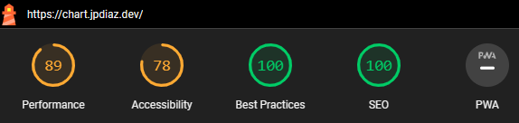

<div id="top"></div>

# Chart.js Library 📊

Chart.js is a JavaScript library that allows you to create beautiful charts to represent your data. It's easy to use and has a wide variety of chart types to choose from.

Learn more about [Chart.js](https://www.chartjs.org/)

<div align="center">

</div>

In this repository, you'll find the following charts:

- Line Chart
- Area Chart
- Bar Chart
- Pie Chart
- Scatter Chart
- Composed Chart
- Customized Dot Line Chart

<!-- ### Desktop View 🖥️


### iPad view 📱


### Mobile view 📱

 -->

### Lighthouse Score 🚀



### Built With 🔑

Welcome to the [chart](https://chart.jpdiaz.dev), collection.


## Get started 🛠️

To get started with [chart](https://chart.jpdiaz.dev), simply clone the repository and follow the setup instructions. You'll be up and running in no time!

### Setup 📋

1. Clone the repo
2. Install dependencies
   ```sh
   npm install
   ```
3. Start the development server
   ```sh
   npm run dev
   ```
4. Open [http://localhost:3000/](http://localhost:3000/) with your browser to see the result.

## Contribution 🤝

All contributions are welcome. Please read the [CONTRIBUTING guidelines](CONTRIBUTING.md) for details on our code of conduct, and the process for submitting pull requests.

### Contributors 🧑‍💻

<a href="https://github.com/JuanPabloDiaz/chart.js/graphs/contributors"></a><!-- Made with [contrib.rocks](https://contrib.rocks). -->

## License 📜

[chart](https://chart.jpdiaz.dev) is licensed under the MIT License.

I hope you enjoy using the chart repo!

<!-- ACKNOWLEDGMENTS -->

## Acknowledgments 📚

Resources list that I find helpful and would like to give credit to.

[](https://www.chartjs.org/)
[](https://tailwindcss.com/)
[](https://nextjs.org/)
[](https://vercel.com/)

<p align="right">(<a href="#top">👆 Top 👆</a>)</p>
